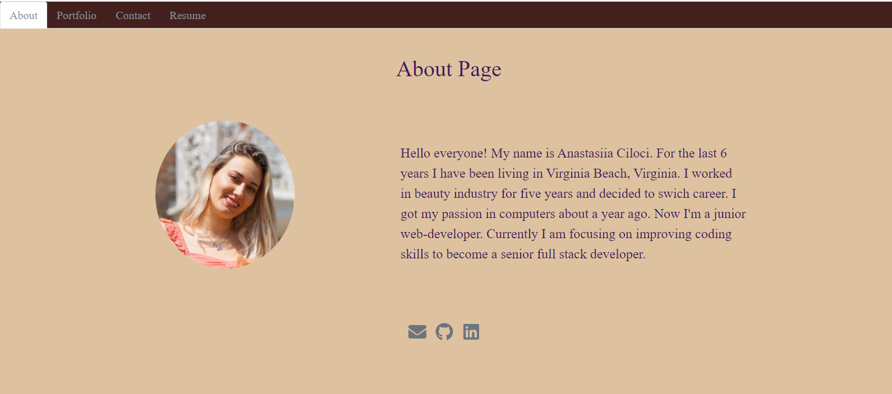

# Ana-React-Portfolio

## Table of content:

1. [Description](#description)
2. [Visuals](#visuals)
3. A [link](https://Anastasiia-Ciloci.github.io/Ana-React-Portfolio/) to an advanced portfolio
4. A [link](https://anastasiiaciloci.herokuapp.com/) to deployed website

# Description

This is a professional portfolio of me made with React. It includes the main projects I did in the last few month.

## Visuals

# A link to the [Advanced Portfolio](https://Anastasiia-Ciloci.github.io/Ana-React-Portfolio/)

Or click [here](https://Anastasiia-Ciloci.github.io/Ana-React-Portfolio/) to open a portfolio.
NEW PORTFOLIO LINK [here](https://anastasiiaciloci.herokuapp.com/)
